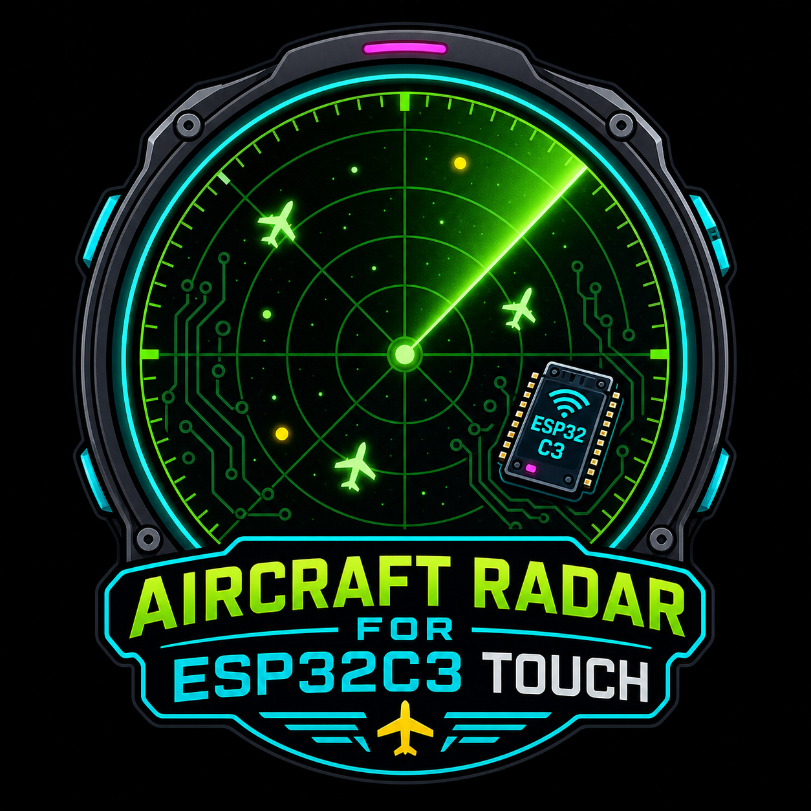

<p align="center">
  
</p>

# Aircraft Radar for ESP32C3 Touch

A direct-draw ESP-IDF aircraft radar for an ESP32-C3 board with a 1.28 inch 240x240 round GC9A01 LCD and CST816 touch controller. It connects to Wi-Fi, looks up your postcode, fetches nearby aircraft from Airplanes.live, and draws a north-up radar view with touch selection and adjustable range.

## What It Does

- Drives a 240x240 round GC9A01 LCD directly over SPI.
- Reads a CST816 touch controller with software I2C.
- Stores Wi-Fi, postcode, and radar range settings in NVS flash.
- Starts a setup Wi-Fi hotspot when the device is unconfigured, Wi-Fi fails, or the screen is held during boot.
- Serves a browser setup page at `http://192.168.4.1`.
- Scans nearby Wi-Fi networks for the setup form.
- Supports open Wi-Fi networks by allowing an empty password.
- Converts a UK postcode into latitude and longitude with `api.postcodes.io`.
- Fetches nearby aircraft from `api.airplanes.live`.
- Refreshes aircraft data every 15 seconds.
- Shows up to 20 aircraft within the configured radar range.
- Calculates aircraft distance and bearing from the saved home location.
- Draws a radar sweep animation every 35 ms.
- Draws range rings in 5 mile steps, with the outer ring set to the current range.
- Supports 5, 10, 15, and 20 mile radar ranges.
- Lets you tap left and right on-screen buttons to decrease or increase range.
- Lets you tap an aircraft marker to open a detail screen.
- Automatically returns from the detail screen after 10 seconds.
- Keeps the last good radar picture if an aircraft refresh fails.
- Includes a separate LCD colour-test source file for hardware bring-up.

## On-Screen Experience

### Boot And Setup Screens

- `BOOT OK`: LCD and app startup has begun.
- `HOLD FOR CONFIG`: shown briefly during boot when touch is available. Touch and hold during this window to enter setup mode.
- `ENTERING CONFIG`: confirms that setup mode was requested.
- `CONFIG MODE`: setup portal is active.
- Setup instructions on the LCD:
  - `CONNECT TO THIS WIFI: RADAR-SETUP`
  - `USE THIS PASSWORD: 12345678`
  - `OPEN IN BROWSER: 192.168.4.1`
- `WIFI START`: connecting to saved Wi-Fi.
- `WIFI OK`: connected successfully.
- `WIFI FAIL`: connection failed and the setup portal will be started.
- `POSTCODE SEARCH`: postcode lookup is running.
- `POSTCODE FOUND OK`: postcode was converted to coordinates.
- `POST FAIL`: postcode lookup or parsing failed.
- `REFRESHING`: first aircraft fetch is running.
- `OPEN FAIL`: a required runtime resource, such as the aircraft mutex or update task, could not be created.

### Radar Screen

- Black circular radar face with green range rings and crosshair lines.
- Yellow outer ring shows the configured maximum range.
- Top text shows the active range, for example `20 MILE`.
- White `N` at the top marks north. The radar is north-up, not device-heading-up.
- Green sweep line rotates around the radar with a fading trail.
- Yellow center dot marks the home position calculated from the postcode.
- Yellow `-` button on the left decreases range.
- Yellow `+` button on the right increases range.
- Bottom-left text shows the configured postcode.
- Bottom-center text shows either:
  - `NEAR x.xMI` for the nearest in-range aircraft.
  - `NO LOCAL AC` when no aircraft are inside the range.

### Aircraft Markers

- Aircraft are plotted by bearing and distance from the home location.
- Each marker is a small filled circle.
- If heading is known, a short nose line points in the aircraft heading direction.
- Faster aircraft get a longer heading line, capped to keep the display readable.
- Aircraft within roughly 8 km can show their callsign beside the marker.
- Marker colours:
  - Cyan: commercial
  - Green: military
  - Blue: police
  - Magenta: air ambulance
  - Yellow: private or unknown

### Aircraft Detail Screen

Tap an aircraft marker to show:

- `AIRCRAFT`
- Callsign
- Distance in miles
- Speed in MPH, or `MPH UNKNOWN`
- Altitude in feet, or `ALT UNKNOWN`
- Aircraft class
- `TAP TO RETURN`

Tapping again returns to the radar. The screen also returns automatically after 10 seconds.

## Browser Setup Portal

When setup mode is active, connect a phone or laptop to:

- SSID: `RADAR-SETUP`
- Password: `12345678`
- URL: `http://192.168.4.1`

The web page lets you:

- Choose a Wi-Fi SSID from a scan list.
- Enter a Wi-Fi password, or leave it blank for open networks.
- Enter the postcode used as the radar center.
- Save settings to NVS.

After saving, the device restarts and reconnects using the new settings.

## Hardware Pinout

### LCD

| Signal | GPIO |
| --- | ---: |
| SCLK | 6 |
| MOSI | 7 |
| DC | 2 |
| CS | 10 |
| RST | Not connected, software reset |
| BL | 3 |

### Touch

| Signal | GPIO |
| --- | ---: |
| SDA | 4 |
| SCL | 5 |
| RST | 1 |
| INT | 0 |
| I2C address | `0x15` |

## Data Sources

- Postcode lookup: `http://api.postcodes.io/postcodes/<postcode>`
- Aircraft lookup: `https://api.airplanes.live/v2/point/<lat>/<lon>/<radius_nm>`

The aircraft API radius is calculated from the radar miles setting and converted to nautical miles. The firmware clamps the request radius between 1 and 250 nautical miles.

## Project Structure

```text
.
├── assets/
│   └── logo.png
├── main/
│   ├── main.c
│   ├── screen_test_fresh.c
│   ├── CMakeLists.txt
│   ├── FLASH Command.txt
│   └── README_aircraft_radar_directdraw_v2.txt
├── CMakeLists.txt
├── partitions.csv
├── sdkconfig
└── sdkconfig.defaults
```

## Firmware Functionality Map

### LCD And Drawing

- `lcd_cmd`, `lcd_data`, `lcd_byte`: send commands and pixel data to the GC9A01.
- `lcd_reset`, `lcd_init_gc9a01`, `lcd_init_hardware`: reset and initialise the LCD/SPI hardware.
- `lcd_set_window`: selects a rectangular LCD write region.
- `lcd_draw_pixel`, `lcd_fill`, `lcd_draw_circle`: direct LCD drawing helpers.
- `lcd_draw_char`, `lcd_draw_text`, `lcd_draw_text_centered`, `lcd_text_width`: built-in 5x7 text rendering.
- `format_int_with_commas`: formats large altitude numbers for the detail screen.
- `lcd_blit_radar_frame`: pushes the off-screen radar framebuffer to the LCD.

### Radar Framebuffer

- `radar_fb_set_pixel`, `radar_fb_clear`: manage the 16-bit RGB565 framebuffer.
- `radar_fb_draw_char`, `radar_fb_draw_text`, `radar_fb_draw_text_centered`: framebuffer text rendering.
- `radar_fb_draw_line`, `radar_fb_draw_circle`, `radar_fb_fill_circle`: radar shape primitives.
- `radar_fb_draw_sweep`: draws the animated green sweep and trail.
- `draw_radar_base`: draws rings, crosshairs, north marker, range buttons, range text, postcode, and sweep.
- `draw_aircraft_marker`: draws one aircraft marker, heading line, and optional callsign label.
- `draw_radar_screen`: renders the full radar view and nearest-aircraft status.

### Touch

- `soft_i2c_init_pins`, `soft_i2c_start`, `soft_i2c_stop`, `soft_i2c_write_byte`, `soft_i2c_read_byte`, `soft_i2c_read_regs`: bit-banged I2C for the touch controller.
- `touch_reset_controller`, `touch_init`: reset and detect the CST816 controller.
- `touch_read_raw`: reads gesture, finger count, and raw touch coordinates.
- `map_touch_to_screen`: maps touch coordinates into LCD coordinates.
- `boot_config_touch_requested`: detects a boot-time hold to enter setup mode.
- `touch_range_direction`: checks whether a touch hit the on-screen `-` or `+` range controls.
- `find_aircraft_at_touch`: selects the nearest in-range aircraft marker inside the touch radius.

### Settings And Setup Portal

- `settings_load`: loads SSID, password, postcode, and range from NVS.
- `settings_save`: validates and saves settings to NVS.
- `settings_apply_derived`: clamps range and prepares the encoded postcode.
- `change_radar_range`: steps the radar between 5, 10, 15, and 20 miles.
- `url_encode_postcode`, `url_decode`, `form_get_value`, `html_escape`: small helpers for the web setup form.
- `scan_wifi_options`: scans nearby access points and builds the SSID dropdown.
- `config_root_handler`: serves the setup form.
- `config_save_handler`: receives form posts, saves settings, and restarts the ESP32-C3.
- `start_config_portal`: starts AP+STA mode and launches the embedded HTTP server.

### Networking And Data Parsing

- `wifi_event_handler`, `wifi_connect`: manage station mode connection and retry logic.
- `http_event_handler`, `http_get`: shared HTTP/HTTPS download helpers.
- `postcode_lookup`: gets latitude and longitude from the configured postcode.
- `airplanes_live_fetch_aircraft`: fetches nearby aircraft around the home location.
- `parse_json_number`, `skip_ws`, `skip_json_value`: lightweight JSON parsing helpers.
- `find_json_object_key`, `read_json_object_number`, `read_json_object_text`, `read_json_object_altitude_ft`: object-field readers for Airplanes.live responses.
- `clean_callsign`: normalises callsigns and falls back to `NOID`.
- `populate_aircraft_geo`: calculates distance and bearing using latitude/longitude.
- `looks_like_airline_callsign`, `aircraft_type_is_airliner`, `id_starts_with`, `id_is_police`, `id_is_air_ambulance`, `classify_aircraft`: classify aircraft into display categories.
- `parse_single_airplanes_aircraft`, `parse_airplanes_live_aircraft`: convert API JSON objects into the in-memory aircraft list.
- `aircraft_update_task`: background task that refreshes aircraft and shares the latest data with the UI loop.

### Application Flow

- `show_status_screen`, `show_status_screen2_colour`, `show_status_screen3_colour`, `show_hold_config_prompt`: full-screen status UI helpers.
- `compute_aircraft_screen_position`: converts aircraft bearing and distance into radar x/y coordinates.
- `aircraft_colour`: maps aircraft class to RGB565 marker colour.
- `apply_range_change`: applies touch range changes.
- `draw_aircraft_detail`: renders the selected aircraft detail screen.
- `app_main`: initialises NVS, LCD, touch, settings, Wi-Fi, postcode lookup, aircraft updates, radar animation, range controls, and aircraft detail navigation.

## Build And Flash

Install ESP-IDF, open an ESP-IDF terminal, then run:

```powershell
idf.py set-target esp32c3
idf.py build
idf.py -p COMx flash monitor
```

Replace `COMx` with the serial port for your ESP32-C3 board.

## Notes

- The default settings in `main/main.c` are only fallbacks. Normal setup should be done through the browser portal.
- The setup hotspot password is currently hard-coded as `12345678`.
- `main/screen_test_fresh.c` is a standalone LCD colour-cycle test and is not the source compiled by the current component CMake file.
- The application is tuned for a 240x240 round display, so UI coordinates are intentionally fixed for that screen.
